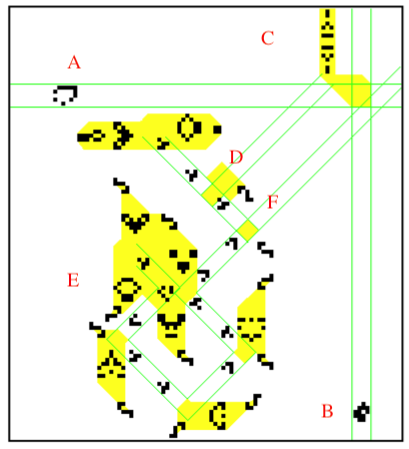

# Lab 3

I am presented with several prompts relating to Conway's Game of Life. I chose the following prompt.

## Prompt

Explain the macro-level behavior of some complicated GOL pattern (such as a Turing machine). Explain what the different components in the pattern are; explain if the pattern takes "input" and explain how to interpret its "output"

Specifically, I've chosen to investigate the 3-State Turing Machine implementation that is exemplified in Golly in the file `Life/Signal-Circuitry/Turing-Machine-3-state.rle`.

## Resources

I found the original paper that explains `Turing-Machine-3-state.rle` here: https://www.ics.uci.edu/~welling/teaching/271fall09/Turing-Machine-Life.pdf

There are other several resources that explain specific and surrounding aspects of "programming" in GOL:
- logic gates from glider/spaceship collisions: http://www.rennard.org/alife/CollisionBasedRennard.pdf
- universal Turing machine implementation: https://github.com/simonbreiter/universal-turing-machine/blob/master/src/universal_turing_machine.py
- Turing universality in GOL: https://www.cs.bgu.ac.il/~sipper/publications/ReviewofTuringMachineUniversality.pdf

## Terminology

- **LWSS**: light-weight spaceship
- **MWSS**: mid-weight spaceship

## Implementation

So, for an analysis of this specific 3-state TM. I name it RTM (for Rendell's Turing Machine). There are several key components to look at. I've divided them into separate `rle` files so that Golly can simulate them independently.

### Cell

The cell first receives an input, and and then doubles that input as its output. The output is used to interfere with a fleet of spaceships going by, leaving holes in the fleet.

The following image demonstrates the specific actions in the cell.

- **A**: external horizontal input for cell; 1 MWSS
- **B**: external vertical input for cell; 1 LWSS
- **C**: formatter for collision of **A, B**; 1 Pentadecathlon
- **D**: input from **C**; 1 glider
- **E**: internal loop of reflecting gliders, which is disrupted by **D**
- **F**: output for cell, from disruption of **E**; 2 gliders

### 
